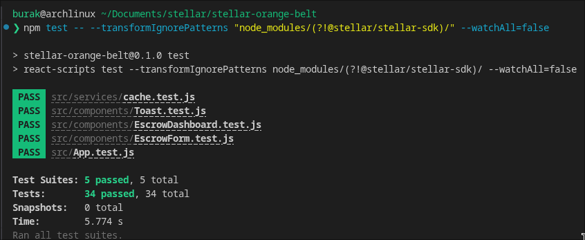

# Stellar Escrow dApp

A fully functional, decentralized Escrow mini-dApp built on Soroban and React.

## Deliverables

- **Live Demo Link:** https://stellar-escrow-dapp.vercel.app
- **Demo Video:** https://youtu.be/ufF4N_hHGX8

### Test Verification



## How to Run

### Clone the Repository

```bash
git clone https://github.com/mrshirolu/stellar-escrow-dapp.git
cd stellar-escrow-dapp
```

### Prerequisites

- `Node.js`, `Rust` and `cargo` installed.
- Enable WebAssembly compilation for Rust:
  ```bash
  rustup target add wasm32-unknown-unknown
  ```

### Smart Contract

1. Navigate to the `escrow-contract` directory:
   ```bash
   cd escrow-contract
   ```
2. Build the contract:
   ```bash
   cargo build --target wasm32-unknown-unknown --release
   ```

### Frontend

1. From the project root, install Node dependencies:
   ```bash
   npm install
   ```
2. Start the local development server:
   ```bash
   npm start
   ```
